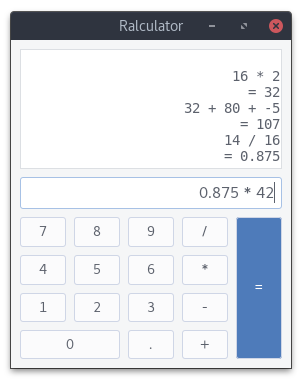

# Ralculator
[](https://travis-ci.org/MoritzKn/ralculator)

A simple calculator [GTK](http://www.gtk.org/) desktop application written in
[Rust](https://www.rust-lang.org/) using [GTK-RS](http://gtk-rs.org/).



## Build instructions
1. Download the source code from [here](https://github.com/MoritzKn/ralculator/releases)
   or clone the git project.
   ```sh
   git clone https://github.com/MoritzKn/ralculator.git
   cd ralculator
   ```
2. Download the dependencies and compile the source code using
   [Cargo](https://crates.io/install).
   ```sh
   cargo build --release
   ```

After cargo is done the binaries are placed under `./target/release/ralculator`.

You can also optionally add the binaries to your `$PATH` and copy the `ralculator.desktop` file to `/usr/local/share/applications/`. To do so execute:

```sh
sudo ./install
```

## License
This project is licensed under the terms of the MIT license.
A copy of the license can be found in the root directory of
the project in the file [LICENSE](./LICENSE).
